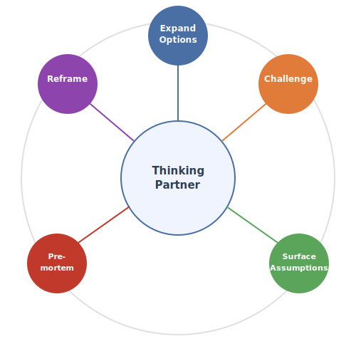

# AI as Thinking Partner

Module 2 showed how AI can analyze data in minutes.  But many of the hardest decisions in business are not data problems --- they are thinking problems.  The data may be clear, but the implications are not.  The options are not fully explored.  The assumptions are unchallenged.  The failure modes are unexamined.

This module is about using AI as a sparring partner: someone who will argue with you, challenge your preferred option, and surface the assumptions you did not know you were making.

## Why AI is a good sparring partner

Most decisions are not made poorly because of missing data.  They are made poorly because of unchallenged assumptions.  The problem is not analytical capacity but intellectual honesty --- and intellectual honesty is hard when everyone in the room has an agenda.

AI has no agenda.  Unlike colleagues, it is not protecting turf, managing up, or afraid to disagree with the boss.  You can say "argue against my preferred option" and it will do so without hurt feelings, without relationship cost, and without pulling punches.  It is a tireless devil's advocate.

There is a subtler benefit as well.  Explaining your reasoning to AI forces you to articulate assumptions you did not know you were making.  The act of structuring the problem for the conversation is itself clarifying.  Many executives report that the most valuable part of a thinking-partner session is not what AI says but what they realized while formulating the question.

## Five conversation moves

There are five specific things you can say to AI to sharpen your thinking about any decision.

{#fig-five-moves width=70% fig-align="center"}

The first is to expand options.  Ask: "What options am I not considering?"  Most decisions are presented as A-vs-B when there are options C, D, and E that nobody has named.

The second is to challenge.  Ask: "Argue against my preferred choice."  This is the classic devil's-advocate move.  Tell AI which option you are leaning toward and ask it to make the strongest case against it.

The third is to surface assumptions.  Ask: "What would need to be true for Option B to win?"  This reframes the debate from arguing about preferences to identifying testable conditions.  It turns a subjective disagreement into an empirical question.

The fourth is the pre-mortem.  Ask: "If this decision fails, what is the most likely reason?"  Pre-mortems are well-studied in decision science; they reliably surface risks that optimism bias would otherwise hide.

The fifth is to reframe.  Ask: "How would a CFO / customer / regulator see this?"  Shifting perspective changes what the "real" question is.  A question about pricing looks different from the sales team's perspective than from the finance team's.

## Example: should we cut our price?

To see these moves in action, consider a scenario.  You are a VP at a mid-size SaaS company.  Your product is $99/month.  A competitor just launched a similar product at $79.  Your CEO wants a recommendation by Friday.

Instead of opening a spreadsheet, you open a conversation.

"We're thinking about dropping our price from $99 to $79 to match a new competitor.  Help me think through whether that's the right move."

Claude does not answer yes or no.  It reframes the decision.  Matching the price is not the only option --- what about a new $79 tier with fewer features while keeping the $99 tier?  Have you considered adding value at $99 instead of cutting price?  A third path: hold the price publicly but offer selective retention discounts to at-risk accounts.  Three options instead of two, and the conversation is thirty seconds old.

"I hadn't considered the tiered approach.  What are the risks of just matching their price?"

Claude lays out the risks.  A 20% price cut requires 25% more customers just to break even on revenue, and your cost structure does not shrink.  It signals to the market that your product was not worth $99.  And competitors can cut again --- you have entered a race you cannot win on price alone.

"OK, argue the other side.  What would need to be true for matching the price to be the right call?"

Claude identifies the conditions.  Matching makes sense if price is the primary reason prospects choose the competitor --- not features or brand.  It also makes sense if your churn data shows price-sensitive customers are already leaving.  And if your margins can absorb it: at $79, are you still above breakeven per customer?

"One more thing.  If we hold the price and it turns out to be wrong, what's the most likely reason?"

Claude runs the pre-mortem.  The most likely failure mode is that the competitor's price resets buyer expectations across the market.  Six months from now, every sales call opens with "Why are you more expensive?" and close rates drop 15%.  The damage is slow and invisible --- you do not lose customers in a rush; you just stop winning new ones.

Five minutes of conversation has produced three options instead of two, the risks of each, the conditions that determine which is right, and a failure scenario to monitor.  No data was harmed in the making of this decision.

## Second-order thinking

Most decisions are evaluated on their immediate outcome.  Second-order thinking asks: what happens *after* the first effect?

The prompt is straightforward: "If we do X and it works, what happens next?  And after that?"

In the pricing example, the first-order effect of cutting prices is that volume increases.  The second-order effect is that competitors respond and margins compress industry-wide.  The third-order effect is that customers expect low prices permanently and the brand is repositioned downmarket.

AI makes this easy because it can generate the chain of consequences in seconds.  You can also ask for the chain in the opposite direction --- "If we do X and it fails, what happens next?" --- and compare the two trajectories to find the earliest signal that tells you which path you are on.

The best decision-makers routinely think two moves ahead.  AI does not replace that instinct, but it automates the generation of consequences so you can focus on evaluating them.

## Steelmanning

Steelmanning is the opposite of straw-manning.  Instead of constructing a weak version of the opposing argument in order to knock it down, you construct the strongest possible version.

The prompt: "Make the strongest possible case for the option I like least."

If the steelman is weak, your preferred option is stronger than you thought.  If the steelman is compelling, you have discovered a genuine risk.  Either way, you learn something.  The technique works because AI has no emotional investment in any option --- it will argue for the position you dislike just as vigorously as it argues for the one you favor.

## Scenario planning

Scenario planning structures uncertainty into a small number of concrete futures.

The prompt: "Give me three scenarios --- optimistic, base case, pessimistic --- with probabilities and specific trigger events."

The key is specificity.  A good scenario is not "things go well" but "the competitor's product launch underperforms because their enterprise features are six months behind, and we capture 30% of their early adopters by Q3."  Each scenario should name a trigger event that you can monitor.  If the trigger fires, you know which scenario you are in and can act accordingly.

Scenario planning is particularly valuable when combined with the pre-mortem.  The pessimistic scenario is essentially a pre-mortem with a probability attached.

## Combining data and thinking

The most powerful conversations blend Module 2 analysis with Module 3 thinking moves.

"Here's my Module 2 memo.  Find the three weakest claims."  This takes the Superstore recommendation you built in the previous module and subjects it to adversarial scrutiny.

"The data says the West region has the highest margin.  What alternative explanations fit the same data?"  This is the scientific method applied to business analysis: generating alternative hypotheses for the same evidence.

"I recommended expanding product line X.  Run a pre-mortem on that recommendation."  This applies the pre-mortem not to a hypothetical scenario but to your own work.

## Challenging your own analysis

Bring your Module 2 analysis and ask AI to poke holes in it.  Open your recommendation memo and ask:

> Read this memo.  What are the three weakest claims?  What data would strengthen or disprove each one?

> What did I miss?  What alternative explanations fit the same data?

AI catches common blind spots: correlation treated as causation, survivorship bias in the sample, missing context from external events or seasonality.  The output is not a new memo but a sharper understanding of the old one.  You can then strengthen weak claims with additional data, acknowledge limitations explicitly, or revise the recommendation if warranted.

The memo does not change.  Your confidence in it does.

## From analysis to action

A thinking-partner conversation should end with clarity, not more questions.

Close the conversation with prompts like: "Summarize the three strongest arguments for my recommendation."  "What are the two biggest risks I should name when I present this?"  "Write a one-paragraph executive summary that acknowledges the limitations."

You leave with a recommendation you have stress-tested, risks you can name before someone else does, and language ready for the meeting or memo.  The thinking partner does not decide for you.  It makes you harder to argue against.

## Exercises

::: {.callout-note title="Exercise 1: The Five-Move Workout" collapse="true"}
Pick a real decision you are currently facing --- work or personal.  Have a thinking-partner conversation with Claude in which you use each of the five moves exactly once: expand options, challenge, surface assumptions, pre-mortem, and reframe.

After each move, write one sentence describing what the move revealed.  At the end, reflect: did AI change your mind?  Did it surface something you had not considered?

Write up the conversation transcript and a five-sentence reflection, one per move.
:::

::: {.callout-note title="Exercise 2: Challenge Your Module 2 Analysis" collapse="true"}
Open the recommendation memo you wrote in Module 2 (or re-run the Superstore analysis using [superstore.csv](files/data/superstore.csv)).  Give the memo to Claude and ask it to find the three weakest claims.

For each weak claim, ask what data you would need to strengthen it.  Then ask Claude to rewrite the executive summary to acknowledge the limitations it identified.

Compare the original and revised summaries.  Which one would survive tougher scrutiny in a meeting?
:::

::: {.callout-note title="Exercise 3: Challenge Your Retention Memo" collapse="true"}
Open the retention memo you wrote in Module 2 Exercise 3 (or re-run the attrition analysis using [employee-attrition.csv](files/data/employee-attrition.csv)).  Give the memo to Claude and work through three thinking-partner moves.

First, ask Claude to argue against your top recommendation.  If you recommended reducing overtime, have it make the case that overtime is a symptom, not a cause.  If you recommended raising salaries, have it explain why that might not move the needle.

Second, ask: "What would need to be true for my recommendations to fail?"  Identify the assumptions your memo depends on.

Third, run a pre-mortem: "We implemented all three interventions and attrition got worse.  What happened?"

Revise your memo to acknowledge the strongest counterargument.
:::

::: {.callout-note title="Exercise 4: Scenario Swap" collapse="true"}
If you are working through this course with a colleague, write down a real business decision you are facing in one or two sentences.  Swap scenarios.  Have a thinking-partner conversation about your colleague's scenario using at least three of the five conversation moves.

Share back: "Here's what AI surfaced about your decision."  It is often easier to be objective about someone else's problem.
:::

::: {.callout-note title="Exercise 5: Second-Order Thinking Practice" collapse="true"}
Consider the following decision: "We are going to require all employees to return to the office five days a week."

Ask Claude to trace three levels of consequences if this decision works as intended.  Then ask it to trace three levels of consequences if it does not work as intended.

Compare the two chains.  Where do they diverge?  What is the earliest signal that tells you which path you are on?
:::

::: {.callout-note title="Exercise 6: Stakeholder Simulation" collapse="true"}
Write a one-paragraph proposal --- a new initiative, a policy change, or a budget request.

Ask Claude to react to the proposal as four different stakeholders: your CEO, your CFO, a skeptical board member, and a front-line employee.  For each persona, note the main concern and what would win them over.

Revise the proposal to address the top two concerns.
:::
