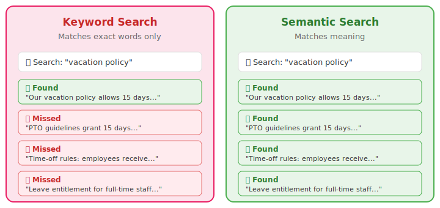

# Retrieval-Augmented Generation

The previous modules worked with structured data --- spreadsheets and databases where every row has the same columns.  But much of the knowledge in an organization lives in unstructured documents: policy handbooks, contracts, product manuals, research reports, meeting transcripts.  This module covers Retrieval-Augmented Generation, or RAG --- the technique that lets AI answer questions about your documents with grounded, cited answers instead of hallucinations.

## The problem: AI does not know your documents

AI models are trained on public data.  They know a great deal about the world in general, but they know nothing about your company's travel policy, your product warranty terms, or last quarter's board report.

Without RAG, if you ask "What is our return policy for enterprise customers?" the LLM will either make something up (confidently and plausibly) or admit it does not know.  Neither response is useful.  What you want is for the system to look up the answer in your actual policy document, quote the relevant passage, and tell you where it found it.

That is what RAG does.

RAG is one of several ways to give AI knowledge it was not trained on.  The choice depends on how much control you need and how much effort you can invest.

```{mermaid}
%%| label: fig-knowledge-approaches
%%| fig-cap: "Three ways to give AI knowledge it was not trained on — from least effort to most control."
%%| fig-width: 90%
flowchart TD
    subgraph RAG["📄 RAG"]
        R1["Feed documents at query time"]
        R2["Best when facts change often\nor data is proprietary"]
        R3["_Least effort — no model changes_"]
    end
    subgraph FT["🔧 Fine-Tuning"]
        F1["Retrain the model on your data"]
        F2["Best for specialized tone,\nformat, or domain expertise"]
        F3["_Moderate effort — needs training data_"]
    end
    subgraph SLM["🏠 Small Language Model"]
        S1["Run a private model on your hardware"]
        S2["Best for full control,\nprivacy, or niche tasks"]
        S3["_Most effort — full infrastructure_"]
    end

    RAG --- FT --- SLM

    style RAG fill:#e8f5e9,stroke:#4caf50
    style FT fill:#fff3e0,stroke:#ff9800
    style SLM fill:#fce4ec,stroke:#e91e63
```

This module focuses on RAG --- the lightest-weight option and the one most accessible to business teams without machine-learning infrastructure.

## The open-book exam analogy

The simplest way to understand RAG is the open-book exam.  Standard AI is a closed-book exam: the student answers from memory, is confident even when wrong, and cannot cite sources.  RAG is an open-book exam: the student looks up the answer in the reference materials, quotes the source, and can say "this is not covered in my materials" when the answer is not there.

The quality of the answer depends entirely on what is in the book.  If the documents are incomplete, outdated, or poorly organized, the RAG system will produce incomplete, outdated, or confused answers.  The AI is only as good as the documents you give it.

## The RAG pipeline

RAG works in three stages: ingest, retrieve, and generate.

In the ingest stage, documents are split into chunks --- typically paragraphs or sections --- and each chunk is converted into a numerical representation called an embedding.  The embeddings are stored in a vector database (a searchable index optimized for similarity search).

In the retrieve stage, when a user asks a question, the question is also converted into an embedding.  The system finds the chunks whose embeddings are most similar to the question's embedding.  These are the chunks most likely to contain the answer.

In the generate stage, the retrieved chunks are fed to the LLM along with the user's question.  The LLM reads the chunks and generates an answer, citing the sources.

```{mermaid}
%%| label: fig-rag-pipeline
%%| fig-cap: "The three stages of RAG: ingest documents, retrieve relevant chunks, generate a cited answer."
%%| fig-width: 100%
flowchart LR
    subgraph Ingest["1. Ingest"]
        direction TB
        Docs["📄 Documents"] --> Chunk["✂️ Chunk"] --> Embed1["🔢 Embed"] --> Store["🗃️ Vector\nStore"]
    end
    subgraph Retrieve["2. Retrieve"]
        direction TB
        Question["❓ Question"] --> Embed2["🔢 Embed"] --> Search["🔍 Similarity\nSearch"] --> Chunks["📋 Relevant\nChunks"]
    end
    subgraph Generate["3. Generate"]
        direction TB
        Input["📋 Chunks +\n❓ Question"] --> LLM["🧠 LLM"] --> Answer["✅ Cited\nAnswer"]
    end

    Store -. "indexed\nchunks" .-> Search
    Chunks --> Input

    style Ingest fill:#e3f2fd,stroke:#2196f3
    style Retrieve fill:#fff3e0,stroke:#ff9800
    style Generate fill:#e8f5e9,stroke:#4caf50
```

## Embeddings and semantic search

Embeddings are what make RAG fundamentally different from keyword search.

Traditional keyword search finds documents containing the exact words you typed.  If you search for "vacation policy," you will find documents containing those words but miss documents that say "PTO guidelines" or "time-off rules" or "leave entitlement."

Semantic search works on meaning.  Embeddings convert text into high-dimensional numerical vectors such that texts with similar meanings point in similar directions.  When you search for "vacation policy," semantic search finds all of those variations because they have similar embeddings.  It understands meaning, not just words.

This is why RAG can answer questions in natural language.  You do not need to know the exact terminology used in the document.  You ask the question in your own words and the system finds the relevant passages regardless of how they are phrased.

{#fig-keyword-vs-semantic fig-align="center"}

## Citations and source attribution

RAG does not just answer --- it shows where the answer came from.

Each answer includes references to the source documents and, when possible, page numbers or section headings.  Users can click through to verify the original text.  If the answer is not in the documents, a well-built RAG system says so instead of hallucinating.

Citations transform AI from "trust me" to "here's the evidence."  This is what makes RAG suitable for high-stakes use cases where accuracy matters and where someone will eventually ask "where did you get that number?"

## When to use RAG

RAG is not always the right approach.  The choice depends on the type of data.

For structured data (spreadsheets, databases, tables of numbers), a skill that writes SQL queries is more appropriate.  This is what you built in Module 5.

For unstructured documents (policies, contracts, manuals, reports), RAG is the right tool.

For small texts that fit within the AI's context window (fewer than about 100 pages), you can skip the RAG pipeline entirely and just give the document directly to the AI.  A coding agent does this naturally when you point it at a folder containing documents.

::: {.callout-tip title="Context window sizes"}
The amount of text an agent can process in one session varies.  Gemini CLI supports up to one million tokens (roughly 3,000 pages).  Codex supports 192,000 tokens.  Claude Code's limit depends on the model, ranging from 200,000 to over 1,000,000 tokens.  For most business documents, any of these is sufficient for direct reading without RAG.
:::

For situations where you need both structured queries and document context, you can combine a skill with RAG --- querying the database for numbers and the documents for context.

```{mermaid}
%%| label: fig-rag-decision
%%| fig-cap: "Choosing the right approach depends on what kind of data you are working with."
%%| fig-width: 80%
flowchart TD
    Start["What kind of data?"]
    Structured["Structured?\n_Tables, databases_"]
    Small["Small document set?\n_< ~100 pages_"]
    Large["Large document set?\n_Hundreds of pages+_"]

    SQL["→ SQL skill\n_Module 5_"]
    Direct["→ Direct context\n_Give it to the agent_"]
    RAG["→ RAG pipeline\n_Chunk, embed, retrieve_"]
    Both["→ Skill + RAG\n_SQL for numbers,\nRAG for context_"]

    Start -->|"Yes"| Structured
    Start -->|"No — documents"| Small
    Structured -->|"Only numbers"| SQL
    Structured -->|"Numbers + documents"| Both
    Small -->|"Yes"| Direct
    Small -->|"No"| Large
    Large --> RAG

    style SQL fill:#e3f2fd,stroke:#2196f3
    style Direct fill:#e8f5e9,stroke:#4caf50
    style RAG fill:#fff3e0,stroke:#ff9800
    style Both fill:#f3e5f5,stroke:#9c27b0
```

## Why chunk size matters

Documents are split into chunks before embedding.  The size of these chunks determines what the system can find and what it misses.

Chunks that are too small (individual sentences) lose context.  A sentence alone may be meaningless without the paragraph around it.  The system retrieves fragments instead of answers.

Chunks that are too large (entire chapters) include too much irrelevant content.  The signal is diluted by noise.  The AI may struggle to identify which part of the chunk actually answers the question.

The sweet spot is usually a few paragraphs --- enough context to be meaningful, small enough to be relevant.  Overlapping chunks (where each chunk shares some text with its neighbors) help ensure that nothing falls through the cracks.

## Common failure modes

RAG is not perfect.  Understanding the failure modes helps you spot and fix problems.

On the retrieval side, the system may retrieve the wrong chunk (semantically similar but irrelevant), miss the right chunk entirely (the answer exists but was not retrieved), or retrieve chunks that contradict each other.

On the generation side, the LLM may hallucinate a citation (citing a page that does not contain the claim), over-generalize (drawing a conclusion the source does not support), or give an incomplete answer (using one chunk when the full answer spans multiple documents).

The most dangerous failure is the hallucinated citation.  The answer looks grounded --- it has a source reference --- but when you check the cited passage, it does not say what the LLM claims.  This creates false confidence, which is worse than no citation at all.

## Hands-on: querying your documents

The simplest way to experience RAG is to point your coding agent at a folder of documents and start asking questions.

Download the [sample company handbook](files/data/company-handbook.md) and place it in a folder.  Open your coding agent in that folder.  Then ask questions:

> What is our return policy for enterprise customers?

> What are the eligibility requirements for the bonus program?

> How many days of PTO do employees with five years of service receive?

For each answer, evaluate three things.  Is it relevant --- did it find the right section of the document?  Is it faithful --- does the answer accurately represent what the source says?  Is it complete --- did it find all the relevant passages, or did it miss something?

Then test the boundaries.  Ask a question the document cannot answer: "What is our competitor's market share?"  Does AI admit the information is not in the document, or does it hallucinate an answer?

## Evaluating RAG quality

There are three dimensions for judging whether a RAG answer is good.

Relevance measures whether the retrieved passages are on-topic.  Did the system find the right sections?  Would a human reading the document have picked the same passages?

Faithfulness measures whether the generated answer accurately represents the source material.  Does the answer match what the cited passage actually says?  Are there any added claims that go beyond the source?

Completeness measures whether the system found everything relevant.  Did it retrieve all the passages that bear on the question?  Would adding more context from the document change the answer?

Use these three questions to evaluate every RAG answer: is it relevant, faithful, and complete?

## RAG in production

In production, RAG has a document pipeline that runs continuously.  New documents are automatically chunked and embedded.  A vector store (Pinecone, Weaviate, Chroma, or similar) maintains a searchable index of all document chunks.  When a user asks a question, the system retrieves the most relevant chunks, feeds them to the AI, and returns a cited answer.

Production RAG requires ongoing maintenance.  Documents need refresh schedules so that updated policies replace outdated ones.  Access controls ensure that users can only query documents they are authorized to see.  Versioning tracks changes so that when a policy is updated, the old version expires from the index.

Quality assurance means maintaining a test suite of known question-answer pairs to validate accuracy, monitoring retrieval quality over time, and building a feedback loop where users can flag incorrect answers for improvement.

The same sandbox-audit-deploy pattern from Module 6 applies.  RAG is a system, not a feature, and it needs the same care as any production system.

## Exercises

::: {.callout-note title="Exercise 1: Document Querying" collapse="true"}
Download the [company handbook](files/data/company-handbook.md) and place it in a folder.  Open your coding agent in that folder and ask five questions about the content.

For each answer, evaluate relevance (did it find the right section?), faithfulness (does the answer match the source?), and completeness (did it find everything relevant?).  Rate each dimension on a 1-to-5 scale.

Then ask two questions the document cannot answer.  Does AI admit it does not know, or does it hallucinate?

:::

::: {.callout-note title="Exercise 2: Citation Verification" collapse="true"}
Ask three questions about the [company handbook](files/data/company-handbook.md) and get answers with citations.

For each answer, locate every cited passage in the original document.  Rate each citation: accurate (the passage says what the AI claims), partially accurate (the passage is related but the AI stretched or paraphrased), or hallucinated (the passage does not support the claim).

If any citation is inaccurate, rephrase the question and see if the citation improves.

:::

::: {.callout-note title="Exercise 3: Conflicting Sources" collapse="true"}
Create a second version of the [company handbook](files/data/company-handbook.md) in which you change one or two facts (for example, change the PTO accrual rates or the return policy window).  Place both versions in the same folder.

Ask a question where the two versions disagree.  Does AI cite both?  Pick one?  Acknowledge the conflict?

This simulates a common production problem: stale documents coexisting with current ones.
:::

::: {.callout-note title="Exercise 4: RAG vs. Direct Reading" collapse="true"}
Ask your coding agent to read the entire [company handbook](files/data/company-handbook.md) as one document and answer a question (this is the direct-context approach).  Then ask the same question in a way that forces chunked retrieval (for example, by placing many documents in the folder so the handbook is too large for the context window to hold in full).

Compare the two answers.  Which is more complete?  Does the direct-reading approach catch context that chunked retrieval misses?

This exercise illustrates the tradeoff: direct context is better for small document sets, while RAG scales to thousands of documents.
:::

::: {.callout-note title="Exercise 5: RAG Use Case Proposal" collapse="true"}
Write a one-page proposal for deploying RAG in your organization.

Identify the document set (employee handbook, product documentation, compliance policies, or whatever is most relevant to your work).  Describe the users and their typical questions.  Outline the architecture: how documents would be ingested, where the vector store would live, and how users would interact with the system.

List three risks and how you would mitigate them.  The most common risks are hallucinated citations (mitigated by citation verification workflows), stale documents (mitigated by refresh schedules), and unauthorized access (mitigated by document-level permissions).

:::
